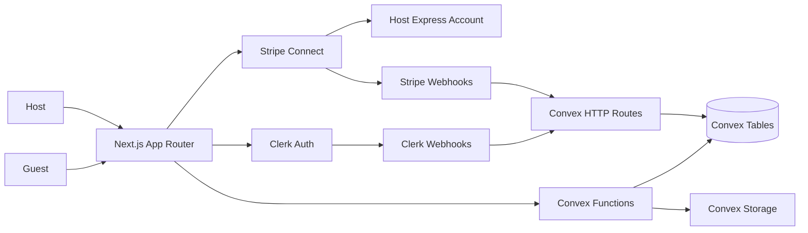
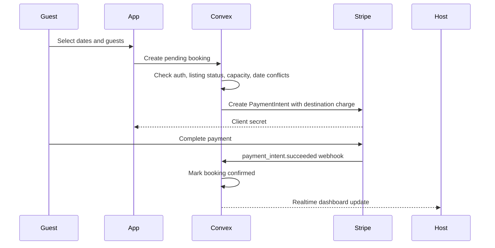

# PickleBnB MVP Spec

## Goal

Build PickleBnB as a phased Airbnb-style marketplace. Phase 1 should let a user sign in, become a host, create and publish listings, onboard to Stripe Connect Express, accept paid bookings, and manage host/guest dashboards. Phase 2 adds richer marketplace features such as reviews, messaging, wishlists, advanced calendars, and map polish.

## Current Baseline

- The app is a small Next.js, React, Convex, Clerk, and Tailwind project.
- Clerk is present in the Next layout and Convex client provider, but Convex auth still needs the Clerk provider enabled.
- Convex currently contains starter `numbers` demo schema and functions that should be replaced by marketplace domain tables.
- Stripe is not yet integrated.
- Shadcn is not yet installed/configured in the repo.

## External Tooling Notes

### Stripe Projects

Stripe Projects should be used for setup and environment management, not as the runtime payment layer.

Recommended usage:

```bash
stripe plugin install projects
stripe projects status
stripe projects llm-context
stripe projects env --pull
```

Use Stripe Projects to provision or link supported services, sync local credentials, and generate provider context for AI-assisted setup. The actual booking payment flow still needs Stripe Connect code in the app using Stripe APIs and webhooks.

### Clerk CLI and Agent Guidance

Use Clerk CLI/docs support to validate Clerk app setup, environment variables, OAuth providers, and webhook configuration. Clerk remains the identity provider; Convex stores the app profile and authorization-related data.

### Shadcn

Use Shadcn components for forms, dialogs, drawers, cards, tabs, tables, skeletons, badges, calendars, and dashboard UI. No Shadcn MCP server is currently visible in the enabled MCP list, so implementation should use the Shadcn CLI/docs unless that server is added later.

## Phase 1 MVP

### User Capabilities

- Sign in with Clerk using email, Google, and Apple.
- Maintain a profile with avatar, display name, and bio.
- Use one account as both guest and host.
- Access protected host and guest dashboard routes.
- Host can onboard to Stripe Connect Express.
- Host can create, edit, publish, unpublish, archive, and manage listings.
- Guest can search listings, view listing details, book available dates, pay, and cancel when eligible.

### Marketplace Capabilities

- Published listing discovery with category, location, date, guest, price, type, amenity, and instant-book filters.
- Listing detail page with photo gallery, amenities, rules, availability, map area, and sticky booking widget.
- Booking state machine with pending, confirmed, cancelled, and completed states.
- Stripe Connect destination charges with a platform application fee.
- Host dashboard for listings, bookings, onboarding status, and basic earnings visibility.
- Guest dashboard for upcoming, current, and past trips.

## System Architecture



## Data Model Draft

### `users`

Stores the app profile synced from Clerk plus host/payment status.

Important fields:

- `tokenIdentifier`: canonical Convex auth identity key.
- `clerkUserId`: Clerk user ID from webhook events.
- `email`, `name`, `imageUrl`, `bio`.
- `roles`: guest/host capability flags or role literals.
- `stripeConnectedAccountId`.
- `stripeChargesEnabled`, `stripePayoutsEnabled`, `stripeDetailsSubmitted`.
- `stripeRequirementsDue`, `stripeLastSyncedAt`.

Indexes:

- `by_tokenIdentifier`
- `by_clerkUserId`
- `by_stripeConnectedAccountId`

### `listings`

Stores stable listing content and indexed search fields.

Important fields:

- `hostId`
- `status`: `draft`, `published`, `archived`
- `title`, `description`, `propertyType`, `category`
- `addressLine1`, `city`, `region`, `country`, `postalCode`
- `locationSlug`, `latitude`, `longitude`
- `nightlyPriceCents`, `cleaningFeeCents`, `serviceFeeBasisPoints`
- `maxGuests`, `bedrooms`, `beds`, `bathrooms`
- `instantBook`
- `checkInTime`, `checkOutTime`
- `houseRules`
- `publishedAt`, `updatedAt`

Indexes:

- `by_hostId_and_status`
- `by_status_and_category`
- `by_status_and_locationSlug`
- `by_status_and_nightlyPriceCents`
- `by_status_and_maxGuests`

### `listingPhotos`

Stores one row per image to avoid unbounded arrays on listings.

Important fields:

- `listingId`
- `storageId`
- `url`
- `alt`
- `sortOrder`
- `isCover`

Indexes:

- `by_listingId_and_sortOrder`
- `by_listingId_and_isCover`

### `listingAmenities`

Stores amenity tokens per listing.

Important fields:

- `listingId`
- `amenity`

Indexes:

- `by_listingId`
- `by_amenity`

### `listingAvailabilityBlocks`

Stores host-blocked date ranges.

Important fields:

- `listingId`
- `startDate`
- `endDate`
- `reason`: `host_blocked`, `maintenance`, `manual_hold`

Indexes:

- `by_listingId_and_startDate`

### `bookings`

Stores booking and payment state.

Important fields:

- `listingId`, `hostId`, `guestId`
- `startDate`, `endDate`, `nights`, `guestCount`
- `status`: `pending`, `confirmed`, `cancelled`, `completed`
- `nightlySubtotalCents`, `cleaningFeeCents`, `serviceFeeCents`, `taxCents`, `totalCents`
- `currency`
- `stripePaymentIntentId`, `stripeChargeId`, `stripeRefundId`
- `cancelledAt`, `cancelledBy`, `cancellationReason`

Indexes:

- `by_listingId_and_startDate`
- `by_guestId_and_startDate`
- `by_hostId_and_startDate`
- `by_status`
- `by_stripePaymentIntentId`

### `webhookEvents`

Tracks idempotency for Clerk and Stripe webhooks.

Important fields:

- `provider`: `clerk` or `stripe`
- `eventId`
- `eventType`
- `processedAt`

Indexes:

- `by_provider_and_eventId`

## Auth and Authorization Rules

- Never accept a user ID as an authorization source from the client.
- Derive the current user from `ctx.auth.getUserIdentity()`.
- Use `identity.tokenIdentifier` as the stable auth-linked lookup key.
- Listing mutations require the current user to own the listing.
- Booking mutations require the current user to be the guest, except host/admin management flows added later.
- Host dashboard queries only return data for listings owned by the current user.
- Guest dashboard queries only return bookings made by the current user.

## Booking Flow



## Stripe Connect Flow

1. Host clicks onboarding CTA.
2. Convex action verifies authenticated host profile.
3. If the user has no connected account, create a Stripe Express account.
4. Create a single-use account onboarding link.
5. Redirect host to Stripe.
6. On return, show onboarding status but do not assume completion.
7. Stripe `account.updated` webhook updates `stripeChargesEnabled`, `stripePayoutsEnabled`, and requirements.
8. A host cannot receive paid bookings until charges/transfers requirements are satisfied.

## Cancellation Policy for MVP

Use a simple platform policy:

- Guest can cancel with full refund until 48 hours before check-in.
- Guest cancellation inside 48 hours is blocked in MVP unless support/admin tooling is added.
- Host cancellation should be allowed from host dashboard but treated as a full refund.
- Refund status should be driven by Stripe response/webhook and reflected on the booking.

## Route Map

Public routes:

- `/`
- `/listings/[listingId]`
- `/search`

Auth routes and account:

- Clerk modal or hosted sign-in/sign-up.
- `/account/profile`

Guest routes:

- `/guest/trips`
- `/guest/trips/[bookingId]`

Host routes:

- `/host`
- `/host/onboarding`
- `/host/listings/new`
- `/host/listings/[listingId]/edit`
- `/host/listings/[listingId]/calendar`
- `/host/bookings`

API/HTTP routes:

- Convex HTTP route for Clerk webhooks.
- Convex HTTP route for Stripe webhooks.

## UI Component Plan

Use Shadcn components where practical:

- `Button`, `Card`, `Badge`, `Input`, `Textarea`, `Select`, `Checkbox`
- `Dialog`, `Drawer`, `Sheet`, `Popover`
- `Tabs`, `Table`, `Skeleton`, `Alert`, `Calendar`
- `Form` wrappers if a form library is added

Use Tailwind container queries for listing cards, dashboard panels, and booking widgets so components respond to their container rather than only the viewport.

## Phase 1 Milestones

### Milestone 1: Auth Foundation

Deliverables:

- Clerk JWT provider enabled for Convex.
- Protected route matcher expanded.
- `users` table and profile functions.
- Clerk webhook sync with idempotency.
- Starter homepage demo replaced with marketplace shell.

Verification:

- Signed-in users can load a Convex `viewer`.
- Signed-out users cannot access protected dashboards.
- Clerk webhook creates/updates/deletes Convex users.

### Milestone 2: Listing Foundation

Deliverables:

- Marketplace schema for listings, photos, amenities, and availability blocks.
- Host listing CRUD functions.
- Listing create/edit pages.
- Seed data for development.

Verification:

- Host can create a draft and publish it.
- Non-owner cannot edit another host listing.
- Discovery only shows published listings.

### Milestone 3: Discovery and Detail

Deliverables:

- Homepage category pills and search controls.
- Paginated listing feed.
- Listing detail page with gallery, amenities, rules, and booking widget.

Verification:

- Feed paginates with Convex pagination.
- Filters return bounded results.
- Listing detail handles loading and not-found states.

### Milestone 4: Booking and Payments

Deliverables:

- Booking table and overlap checks.
- Stripe Connect host onboarding.
- PaymentIntent destination charge flow.
- Stripe webhooks for payment/account/refund events.
- Cancellation/refund action.

Verification:

- Double booking the same dates is rejected.
- Payment success confirms booking from webhook.
- Eligible cancellation creates refund and updates booking.

### Milestone 5: Dashboards

Deliverables:

- Host dashboard with listings, bookings, onboarding status, and basic earnings.
- Guest trips dashboard with upcoming/current/past tabs.
- Booking detail and cancellation UI.

Verification:

- Host only sees owned listings/bookings.
- Guest only sees their own trips.
- Dashboard states update via Convex subscriptions.

## Phase 2 Backlog

- Reviews: two-way guest/host reviews, category ratings, 14-day unlock window.
- Messaging: booking/listing-scoped inbox, real-time messages, unread badges.
- Wishlists: saved listings and list management.
- Calendar polish: multi-property calendar, date range editing, drag interactions.
- Map polish: Mapbox price pins, distance sorting, saved map bounds.
- Search polish: external search/indexing if Convex filters become too limited.
- UI polish: lightbox gallery, responsive dashboard refinements, error boundaries, accessibility pass.
- Ops polish: webhook replay tooling, admin/support cancellation, production readiness checklist.

## Open Decisions

- Use Convex storage for photos initially, or choose Cloudinary/S3 for image transformations.
- Use Mapbox in MVP, or ship with location display and defer map pins to Phase 2.
- Define exact platform fee percentage and whether service fees are host-paid, guest-paid, or split.
- Decide whether taxes are manually estimated in MVP or deferred until a tax provider is integrated.
- Decide whether hosts can use instant book only in MVP, or whether booking requests require host approval.
